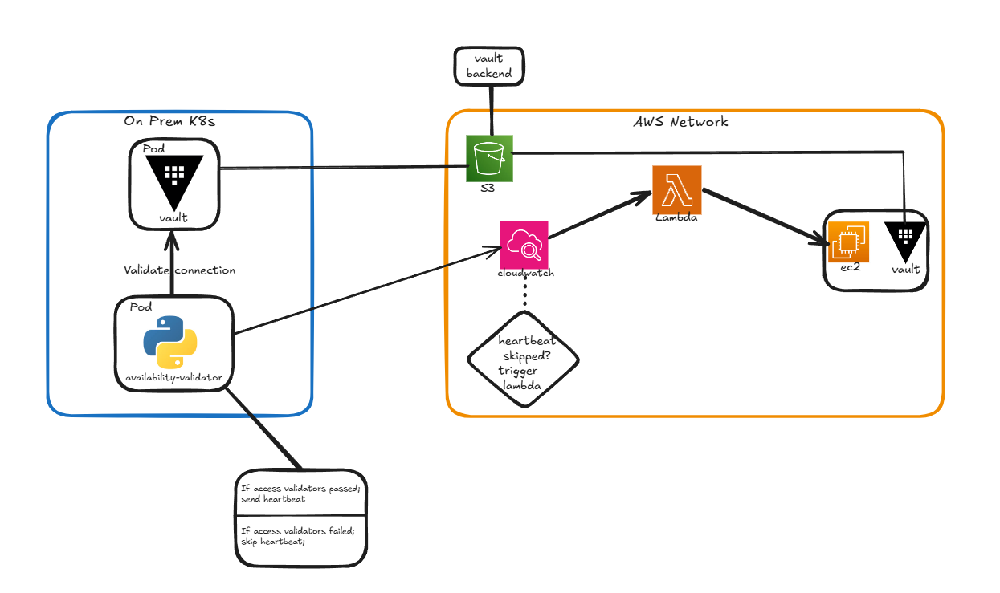

# On-prem to AWS vault failover mechanism and design


This repository assumes you already have on-prem vault up and running with S3 backend and you want to implement a failover mechanism in AWS to serve users once the on-prem instance has failed.


The repo includes : 

1. Failover design diagrams 
2. Failover scripts and tools
3. Custom helm chart

the customised chart, including self signed TLS configuration which assumed you have went through this guide to configure TLS : https://developer.hashicorp.com/vault/tutorials/kubernetes/kubernetes-minikube-tls

The chart also relies on a secured S3 Backend (config.hcl) :

```
storage "s3" {
    access_key = ""
    secret_key = ""
    bucket     = ""
    region     = ""
}
```

which can be applied by running 
```
kubectl create secret generic -n vault vault-backend-config --from-file=config.hcl=config.hcl
```


# Working assumption
This solution doesn't provide 100% uptime of vault and hasn't been tested in real prod enviornment yet!
This design is based entirely on the seal / unseal mechanism of vault and is for people who aren't interested in paying for the enterprise version, i'll explain ;
When vault is restarted you must unseal it in order for it to start working and properly serve read and write requests,
as long as vault isn't unsealed the only actions you can do against the vault server are (quoted from vault docs https://developer.hashicorp.com/vault/docs/concepts/seal) :

 `Prior to unsealing, almost no operations are possible with Vault. For example, authentication, managing the mount tables, etc. are all not possible. The only possible operations are to unseal the Vault and check the status of the seal `

In other it words means you cannot do any write operations, so as long as we do not unseal both on prem instance and the cloud instance together we should not end up in a split-brain or backend corruption issues. <br/>
DR Scenario : <br/> 
1. On prem infrastructure paritally went down (including vault) and infra relying on vault is still working .
2. vault-validator reported to cloudwatch.
3. Cloudwatch triggered lambda which in turn start up the vault ec2 instance and let us know (via SMS that the on prem enviornment is down and we need to unseal the cloud instance).
4. and we as the DevOps Team should now manually unseal the vault cloud instance to serve users.
5. Once the issues with the on prem infrastructure has been solved and vault can operate again we can seal the cloud vault and stop the instance, now we can unseal the on-prem instance and repurpose it.


## Vault Validator
This repo contain vault-validator.py which should be deployed (in what ever method you see fit whether its as a standalone container or K8s Pod)
The validator is responsible to make sure different components of vault are accessible within the on-prem infra, if all validators return False the vault instance is deemed inaccessible.

Need to think of additional validators, this is still WIP! not prod ready

## Terraform
The terraform configuration includes files for cloudwatch, lambda and ec2 instance
once the configuration has been deployed you should leave it up and running except the ec2 instance that should be changed to stopped state (to save cost) it will change to state on by lambda once the cloudwatch is in alarm.
The config assumes the existence of an SSH key so you should modify the existing parameters accordingly.

The terraform configuration contains cloud-init configuration to bootstrap vault on top of ec2 with the same backend config on the on-prem setup.


# Architecture 
